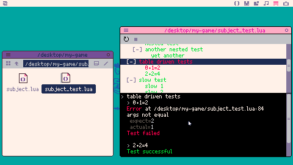

unitron 
=======

Unit testing in Picotron.



How to use?
===========

* download cart png from [releases page](https://github.com/elgopher/unitron/releases) and put it somewhere on Picotron drive (desktop for example)
* run the cart by double clicking 
* create a Lua file with following test code:

```lua
assert_eq("hello", "hello")
```

* drag and drop the file to unitron window
* see [examples](examples) folder for details how to write tests

Test API
========

* [Introduction](#introduction)
* [test](#test)
* [assert_eq](#assert_eq)
* [assert_not_eq](#assert_not_eq)
* [assert_close](#assert_close)
* [assert_not_close](#assert_not_close)
* [assert_nil](#assert_nil)
* [assert_not_nil](#assert_not_nil)
* [assert_same](#assert_same)
* [assert_not_same](#assert_not_same)

Introduction 
------------

Test API provides functions for writing your own tests. You don't have to `include` any Lua files in your test files. Unitron automatically includes all the necessary files for you, when you drag and drop your file into unitron's window.

Tests can be slow. That's why unitron runs them in the background - in a separate process. Thanks to that unitron window is always responsive.

Tests can do whatever they want - they can use any function provided by Picotron. For example, they can draw on screen. The effect will not be visible, because tests are executed in a separate process.

[Back to TOC](#test-api)

test
----

**syntax:** *test(name_of_the_test, function() ... end)*

Starts a test with a given name and code. Test code is inside anonymous function.

```lua
test("name of the test", function()
    -- here goes the test code
end)
```

Tests are executed sequentially.

Tests can be nested. When nested test fails, the parent also fails.

[Back to TOC](#test-api)

assert_eq
---------

**syntax:** *assert_eq(expected, actual, message?)*

Asserts that `expected` and `actual` are equal. Values must have the same type.

For strings, numbers and booleans `==` operator is used.

For tables, all keys and values are compared deeply. 
If you want to compare if two tables points to the same address in memory please use [assert_same](#assert_same) instead. 
Tables could have cycles.

For userdata, all data is compared and userdata must be of the same type, width and height.

[Back to TOC](#test-api)

assert_not_eq
-------------

**syntax:** *assert_not_eq(expected, actual, message?)*

Asserts that `expected` and `actual` are **not** equal. The function has similar behavior to [assert_eq](#assert_eq).

[Back to TOC](#test-api)

assert_close
------------

**syntax:** *assert_close(expected, actual, delta, message?)*

Asserts that `expected` number is close to `actual` number. The maximum error is `delta`.

[Back to TOC](#test-api)

assert_not_close
----------------

**syntax:** *assert_not_close(not_expected, actual, delta, message?)*

Asserts that `not_expected` number is not close to `actual` number. 

[Back to TOC](#test-api)

assert_nil
----------

**syntax:** *assert_nil(actual, message?)*

Asserts that `actual` is `nil`.

[Back to TOC](#test-api)

assert_not_nil
--------------

**syntax:** *assert_not_nil(actual, message?)*

Asserts that `actual` is not `nil`.

[Back to TOC](#test-api)

assert_same
-----------

**syntax:** *assert_same(expected, actual, message?)*

Asserts that `expected` and `actual` are the same. Same as `==` operator.

For tables, `expected` must be a pointer to the same address as `actual`.

For strings, booleans and numbers the function behaves similar to [assert_eq](#assert_eq).  


[Back to TOC](#test-api)

assert_not_same
---------------

**syntax:** *assert_same(not_expected, actual, message?)*

Assert that `not_expected` and `actual` are not the same. The function has similar behavior to [assert_same](#assert_same).

[Back to TOC](#test-api)

Development - how to work on unitron
====================================

* clone repository to Picotron drive and name it unitron.src.p64
    * `git clone https://github.com/elgopher/unitron unitron.src.p64`
    * edit the source code in editor of choice (such as VS Code with sumneko's Lua Language Server)
* to release cartridge
    * go to Picotron terminal and type
        * `cp unitron.src.p64 unitron.p64.png`
    * publish post on BBS